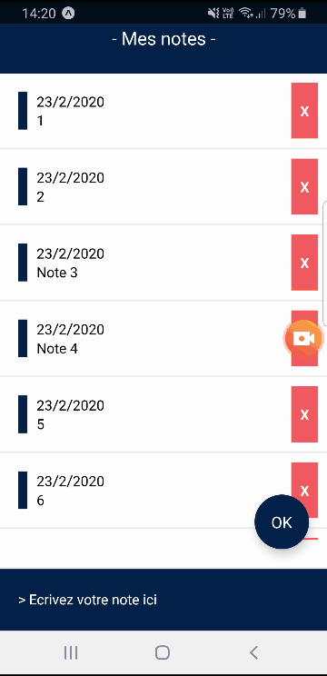

# Workshop - React Native

## Sommaire
### Partie théorique :
- **[Lien vers les slides](https://docs.google.com/presentation/d/1aprbfnAXfBVSbw0MCSaAIarE197XDdSNHpqg3IiU1dY/edit?usp=sharing)**
### Partie pratique, développement d'une appli mobile :
- **[Démo de l'appli](#demo)**
- **[Les installations](#installations)**
- **[L'appli: étape par étape](#appli)**
- **[Mise en ligne de l'application](#en-ligne)**
- **[Aller plus loin](#ressources)**
## La demo de l'appli 

## Les installations 
Vérifier si npm est bien installé sur votre machine :

    npm -v
    
Si ce n'est pas le cas :

    npm install npm@latest -g
    
Pour installer react native (par l'intermédiaire d'expo)  :

    npm install -g expo-cli

Il faudra également installer une appli sur votre mobile :
"Expo" pour Android / "Expo Client" sur iOS

Ensuite, créez un dossier du nom de votre choix sur le bureau et puis allez dans ce dossier avec le terminal.

Une fois positionné dans ce dossier avec le terminal, on va générer un nouveau projet React Native :

    expo init my-app
(my-app étant le nom de l'appli que j'ai choisi, vous pouvez mettre autre chose).

Votre terminal va vous demander de faire un choix ('choose a template') :
Choisissez l'option 'Blank'.

Une fois l'installation terminée, se diriger vers le nouveau dossier créé :

    cd my-app
  
Et puis faire :

    npm start
(pour lancer le serveur de développement).

Une fois le serveur de développement lancé, une page web devrait s'ouvrir dans votre navigateur (à l'adresse localhost:19002) :
- Ouvrez l'application Expo sur votre téléphone
- Choisissez l'option "Scan QR Code" et scanner le code QR qui est sur la page web ouverte devant vous (localhost:19002)
- Un lien va se faire entre votre mobile et votre ordinateur. A chaque changement que vous allez faire dans votre code, vous aurez un "rendu" en temps-réel

Pour terminer, ouvrez le contenu du dossier my-app dans votre éditeur de code.

## Développement de l'appli 
### Création des dossiers et fichiers :
- A la racine du dossier my-app, créez un dossier 'app'
- Dans le dossier 'app', créez un dossier 'components'
- Dans le dossier 'components', créez deux fichiers (deux components) => Main.js / Note.js

### Le composant Main.js :
Copiez ce code dans Main.js :

    import React from  'react';
    import  {  StyleSheet,  Text,  View,  TextInput,  ScrollView,  TouchableOpacity  }  from  'react-native';
    import Note from  './Note';
    
    export  default  class  Main  extends  React.Component  {
    
		constructor(props)  {
		super(props);
		this.state  =  {
		noteArray: [],
		noteText:  "",
			}
		}

		render()  {

		let  notes  =  this.state.noteArray.map((val,  key)  =>  {
		return  <Note  key={key} keyval={key} val={val}  deleteMethod={()  =>  this.deleteNote(key)} />
		});

		return (
		
		<View  style={styles.container}>
			<View  style={styles.header}>
				<Text  style={styles.headerText}>- Mes notes -</Text>
			</View>

			<ScrollView  style={styles.scrollContainer}>
				{notes}
			</ScrollView>

			<View  style={styles.footer}>
			<TextInput  style={styles.textInput} onChangeText={(noteText)  =>  this.setState({ noteText })} value={this.state.noteText} placeholder="> Ecrivez votre note ici"  placeholderTextColor="white"  underlineColorAndroid="transparent"></TextInput>
			</View>

			<TouchableOpacity  onPress={this.addNote.bind(this)} style={styles.addButton}>
				<Text  style={styles.addButtonText}>OK</Text>
			</TouchableOpacity>

		  </View>

		);

		}

		addNote()  {
			if (this.state.noteText) {
				var  d  =  new  Date();
				this.state.noteArray.push({
					'date':  d.getDate() +
					"/"  + (d.getMonth() +  1) +
					"/"  +  d.getFullYear(),
					'note':  this.state.noteText
					});
				this.setState({ noteArray:  this.state.noteArray  })
				this.setState({ noteText:  ''  });

			}

		}

		deleteNote(key)  {
			this.state.noteArray.splice(key,  1);
			this.setState({ noteArray:  this.state.noteArray  })
		}

	}

	const styles = StyleSheet.create({

		container:  {
			flex:  1,
		},

		header:  {
			backgroundColor:  '#03224c',
			alignItems:  'center',
			justifyContent:  'center',
		},

		headerText:  {
			color:  'white',
			fontSize:  18,
			padding:  26,
		},

		scrollContainer:  {
			flex:  1,
			marginBottom:  100,
		},

		footer:  {
			position:  'absolute',
			bottom:  0,
			left:  0,
			right:  0,
			zIndex:  10,
		},

		textInput:  {
			alignSelf:  'stretch',
			color:  '#fff',
			padding:  20,
			backgroundColor:  '#03224c',
			borderTopWidth:  2,
			borderTopColor:  '#ededed',
		},

		addButton:  {
			position:  'absolute',
			zIndex:  11,
			right:  20,
			bottom:  90,
			backgroundColor:  '#03224c',
			width:  60,
			height:  60,
			borderRadius:  50,
			alignItems:  'center',
			justifyContent:  'center',
			elevation:  8,
		},

		addButtonText:  {
			color:  '#fff',
			fontSize:  16,
		},
	});
### Le composant Note.js :
Copiez ce code dans Note.js :

    import React from  'react';
	import  {  StyleSheet,  Text,  View,  TextInput,  ScrollView,  TouchableOpacity  }  from  'react-native';

	export  default  class  Note  extends  React.Component  {
	
		render()  {

		return (

			<View  key={this.props.keyval} style={styles.note}>
				<Text  style={styles.noteText}>{this.props.val.date}</Text>
				<Text  style={styles.noteText}>{this.props.val.note}</Text>
				
				<TouchableOpacity  onPress={this.props.deleteMethod} style={styles.noteDelete}>
					<Text  style={styles.noteDeleteText}>X</Text>
				</TouchableOpacity>
			</View>
		);
		}
	}
	
	const styles = StyleSheet.create({

		note:  {
			position:  'relative',
			padding:  20,
			paddingRight:  100,
			borderBottomWidth:  2,
			borderBottomColor:  '#ededed',
		},

		noteText:  {
			paddingLeft:  20,
			borderLeftWidth:  10,
			borderLeftColor:  '#03224c',
		},

		noteDelete:  {
			position:  'absolute',
			justifyContent:  'center',
			alignItems:  'center',
			backgroundColor:  '#ff6961',
			padding:  10,
			top:  10,
			bottom:  10,
			right:  10
		},

		noteDeleteText:  {
			color:  'white',
			fontWeight:  'bold'
		}
	});

### Le composant App.js (composant principal qui va permettre d'afficher les deux autres) :
Remplacez son contenu par :

    import React from  'react';
	import Main from  './app/components/Main';

	export  default  class  App  extends  React.Component  {
		render()  {
			return (
				<Main  />
			);
		}
	}
## Mise en ligne de l'appli 
Une fois le développement de votre appli terminé, ouvrez un terminal dans le dossier my-app et tapez :

    expo publish
Cela va mettre en ligne votre appli à l'adresse indiquée dans votre terminal, exemple : https://exp.host/@maxime-cao/my-app2
=> Grâce à ça n'importe qui possédant l'appli Expo pourra se rendre sur le lien ci-dessus, tombera sur un site web et pourra scanner un QR code qui lui donnera accès à votre appli via Expo.
## Quelques ressources pour aller plus loin 
### Rendre votre appli disponible pour un store (Play Store / Apple Store) :
- **[Lien pour les configurations](https://docs.expo.io/versions/v36.0.0/workflow/publishing/)**
### Enregistrer les données dans la mémoire du téléphone :
Pour l'instant, dès qu'on quitte notre appli, toutes les notes ne sont pas enregistrées sur le téléphone. Le contenu de l'appli se réinitialise à chaque fois qu'on la relance. Pour éviter ça :
- **[AsyncStorage](https://facebook.github.io/react-native/docs/asyncstorage/)**